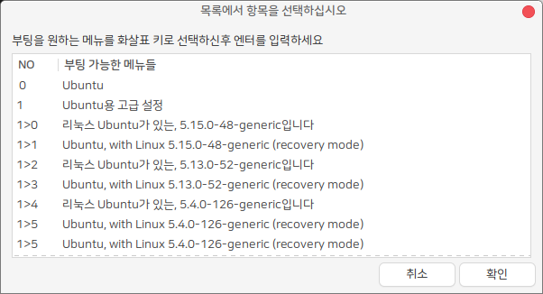

## boot-select

PC에 여러개의 다른 운영체제나 여러개의 커널을 설치한 경우, 기본으로 부팅 될 메뉴를 선택하는 프로그램입니다.

 * HamoniKR-ME (>= 1.4), Ubuntu (>= 18.04), LinuxMint(>=19) 사용 가능.
 * 부트로더 grub2 지원




## Usage
 * 프로그램 > boot-select
 * 또는 터미널에서 sudo boot-select
 * 기본값으로 설정을 원하는 부팅메뉴를 선택하면 자동으로 재시작


## License
 * Apache 2.0

## Install

### ubuntu (>=22.04) , HamoniKR (>=6.0)

터미널을 열고(Ctrl+Alt+T) 아래 명령어를 입력하세요.

```
wget -qO- https://repo.hamonikr.org/hamonikr-app.apt | sudo -E bash -

sudo apt install neofetch
```

### ubuntu (<>=20.04) , HamoniKR (<=5.0)

터미널을 열고(Ctrl+Alt+T) 아래 명령어를 입력하세요.

```
curl -sL https://pkg.hamonikr.org/add-hamonikr.apt | sudo -E bash -
sudo apt update
sudo apt install -y boot-select
```

## 기타 버그 또는 이슈 

사용 중 발견한 버그나 이슈는 [이슈 페이지](https://github.com/hamonikr/boot-select/issues) 또는 [하모니카 커뮤니티](https://hamonikr.org)에서 공유해주세요.
