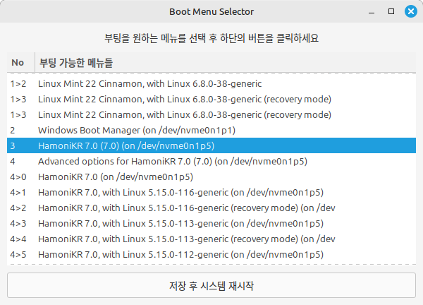

# boot-select

PC에 여러개의 다른 운영체제나 여러개의 커널을 설치한 경우, 기본으로 부팅 될 메뉴를 선택하는 프로그램입니다.

 * HamoniKR-ME (>= 1.4), Ubuntu (>= 18.04), LinuxMint(>=19) 지원
 * 하모니카에 설치된 grub2 지원





# License
 * Apache 2.0

# Install

## HamoniKR 사용자의 경우
터미널을 열고(Ctrl+Alt+T) 아래 명령어를 입력하세요.

```
sudo apt update
sudo apt install -y boot-select
```

## Ubuntu, LinuxMint 등 다른 배포판 사용자의 경우
터미널을 열고(Ctrl+Alt+T) 아래 명령어를 입력하세요.

```
curl -sL https://pkg.hamonikr.org/add-hamonikr.apt | sudo -E bash -
sudo apt install -y boot-select
```


# Usage
 * 프로그램 > boot-select
 * 또는 터미널에서 sudo boot-select
 * 기본값으로 설정을 원하는 부팅메뉴를 선택하면 자동으로 재시작

 # 이슈 또는 버그
 사용 중 문제를 발견하시면 root@hamonikr.org 또는 https://groups.google.com/forum/m/#!forum/hamonikr 에서 알려주세요.
